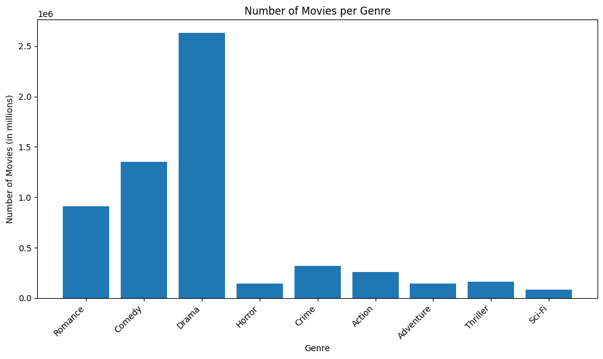
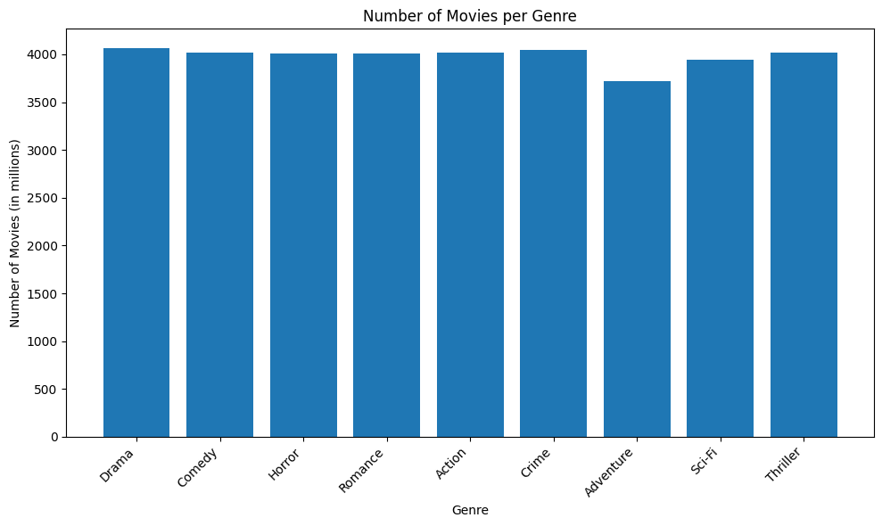
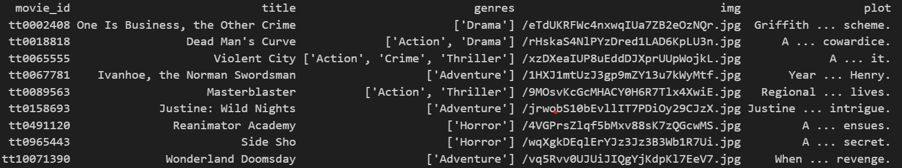
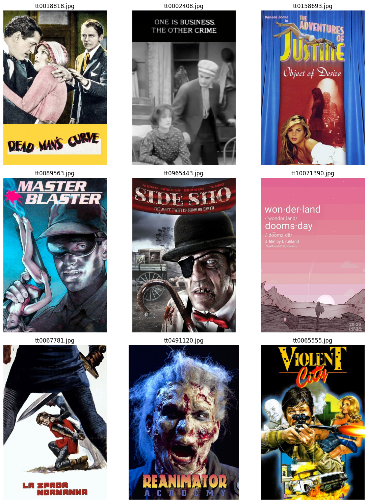
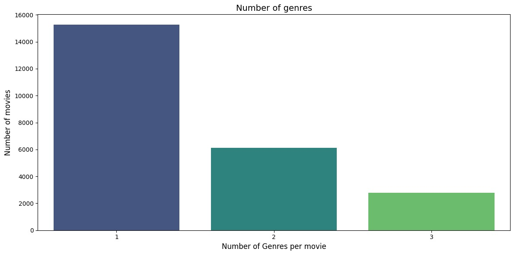
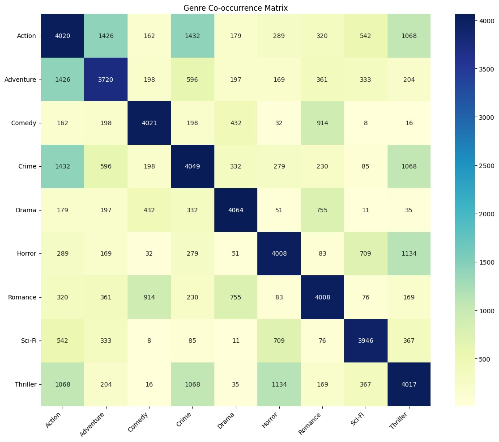
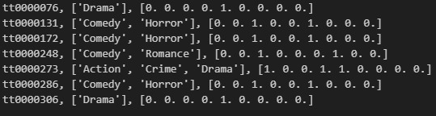
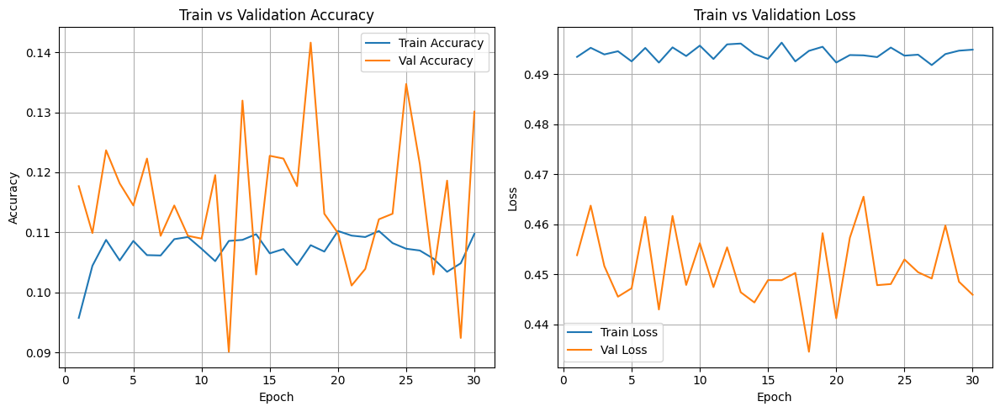
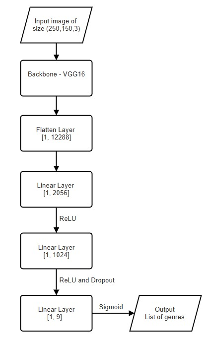

## About

This project demonstrates integration of **two approaches** to movie-genre classification:

- **Text model** – NLP on film synopses  
- **Vision model** – CNN on poster imagery  

Together they outperform single-modality baselines.

---

## Data and Dataset Explanation

[Collection](#how-did-we-collect-data) · [EDA](#exploratory-data-analysis) · [Text Prep](#label-encoding-and-text-processing)

### How did we collect data? 
{:#how-did-we-collect-data}

We decided to use the [title.basics.tsv.gz](https://developer.imdb.com/non-commercial-datasets/) from the IMDB website as our base dataset. Initially, this dataset contained ~4 million datapoints with 28 genres. So, we decided to cut down the number of genres based on the [box-office statistics](https://www.statista.com/statistics/188658/movie-genres-in-north-america-by-box-office-revenue-since-1995) to 9. We selected the genres with the highest revenue in the statistics provided. After filtering the number of genres to 9, we got a dataset which was mostly skewed towards Drama and Comedy

After filtering the number of genres to 9, the dataset was heavily skewed towards *Drama* and *Comedy* (Figure 1).

<figure class="centered-figure">
  
  <figcaption style="text-align: center;"><em>Figure 1 · Genre counts after revenue-based filtering.</em></figcaption>
</figure>

To reduce skewness in the dataset, we leveraged the number of datapoints available per genre. Since the number of movies per genre was large, we capped the number of movies in each genre to approximately  ≈ **4,000 films** as shown below.(Figure 2).

<figure class="centered-figure">
  
  <figcaption style="text-align: center;"><em>Figure 2 · Balanced distribution after capping.</em></figcaption>
</figure>

Next, the problem we faced was that the dataset we used contained only IMDb IDs, titles, and genres. It did not include posters or plots for each movie. So, we used the TMDB API to retrieve plot summaries and poster URLs. One can obtain their own API KEY for retrieving the plots and poster URLs by following the steps on the [TMDB API docs](https://developer.themoviedb.org/reference/intro/getting-started).

Using the TMDB API, we retrieved poster URLs and plots and added them to our dataset in the columns `plot` and `img`. One can directly download our filtered dataset from [Kaggle](https://www.kaggle.com/datasets/kumaramara/movies-with-poster-urls-and-plots).

After downloading the dataset, use this [code](download_posters.html) to download the posters. Make sure you set up your TMDB API key before running the script.

<figure class="centered-figure">
  
  <figcaption style="text-align: center;"><em>Figure 3 · Sample rows after enrichment (`plot`, `img`).</em></figcaption>
</figure>

We saved all posters using their IMDb IDs for easy access.

<figure class="centered-figure">
  
  <figcaption style="text-align: center;"><em>Figure 4 · Random movie posters downloaded via TMDB.</em></figcaption>
</figure>

### Exploratory Data Analysis
{:#exploratory-data-analysis}

To get a better sense of our dataset before training any models, we did some quick exploratory analysis focused on how genres are distributed and how often they appear together. Since our task involves multi-label classification, understanding how many genres each movie has and which genres tend to co-occur is especially important.

<figure class="centered-figure">
  
  <figcaption class="centered-caption">Figure: Distribution of the number of genres per movie (Most movies are tagged with only one genre)</figcaption>
</figure>

From the first plot, we can clearly see that most movies in the dataset (around 15,000) are labeled with **only one genre**. A smaller portion has **two genres**, and even fewer have **three**. This skewed distribution means our dataset is heavily imbalanced when it comes to how many genres are assigned per movie.

<figure class="centered-figure">
  
  <figcaption class="centered-caption">Figure: Genre co-occurrence matrix showing how often different genres appear together in the same movie.</figcaption>
</figure>

The second plot is a co-occurrence matrix that shows how often pairs of genres appear together. Not surprisingly, we see strong co-occurrence between:
- **Action and Crime**
- **Horror and Thriller**
- **Romance and Drama**

These genre combinations are common in real-world movies, so it makes sense they show up a lot here too. On the other hand, some genres like **Comedy** and **Sci-Fi** tend to show up more on their own, with fewer strong pairings.

This matrix also gave us a sanity check that our preprocessing was working correctly — for example, the matrix is symmetrical, which is what we expect (if "Action" co-occurs with "Crime", then "Crime" should co-occur with "Action" by the same amount).

Lastly, while our current model treats genres independently, this matrix shows that there are definitely patterns in how genres are assigned together. It might be worth exploring models or techniques that can actually take these relationships into account, like using label graphs or correlation-aware methods in future work.

---
{: #label-encoding-and-text-processing .section}
## Label Encoding and Text Preprocessing

To handle multi-label genre classification—where a movie may belong to more than one genre—we used **multi-hot encoding**. Each genre was treated as a binary label (1 if present, 0 otherwise), creating an interpretable target vector.

<figure class="centered-figure">
  
  <figcaption class="centered-caption">Figure: Multi-hot label encoding for genres.</figcaption>
</figure>

Before feeding the text into our classifiers, we applied the following preprocessing steps to clean and standardize the plot descriptions:

- Words were tokenized to isolate sentence units.
- Special characters and punctuation were removed.
- Accents were normalized (e.g., “Léon” → “Leon”).
- Common stopwords were filtered using NLTK.
- Lemmatization was used to bring tokens to a base form compatible with GloVe embeddings.

# Classifier

{: #text-model .section}
## Text Classification Model

We explored multiple architectures for textual movie genre classification, including both **Recurrent Neural Networks (LSTM)** and **Transformer-based models**. The goal was to predict one or more genres from the movie synopsis, given its multi-label nature.

### Modeling Choices and Rationale

- **Initial Attempt – BiLSTM:**  
  Our initial model used a bidirectional LSTM with 120 hidden units, GloVe embeddings, and a 70% dropout layer. While this architecture captured sequential dependencies, it struggled to generalize well due to the limited size and variability of the dataset. Loss plateaus and modest F1 scores led us to explore Transformer-based models.

- **Transformer Models – DistilBERT and ELECTRA-Small:**  
  We next experimented with lightweight Transformers. DistilBERT, a distilled version of BERT, was faster and offered some performance gains. However, we found **ELECTRA-Small** to consistently outperform it due to its **discriminator-style pretraining**, which is more sample-efficient for classification tasks.  
  ELECTRA benefits from **bidirectional context** and **pretraining that better aligns with discriminative classification**, making it particularly suitable for genre prediction from apt length plot texts.

### Final Text Model – ELECTRA-Small

The final architecture consisted of an **ELECTRA-Small encoder** followed by a **fully connected classification head**. The classifier predicted a 9-dimensional multi-label output (one for each genre), activated through a sigmoid layer.

#### Hyperparameters:
- **Model**: ELECTRA-Small (`google/electra-small-discriminator`)
- **Loss Function**: BCEWithLogitsLoss (Binary Cross-Entropy for multi-label)
- **Optimizer**: AdamW
- **Learning Rate**: 2e-5
- **Batch Size**: 8
- **Accum**: 2
- **Epochs**: 8
- **Frozen Layers**: 4
- **Warmup Ratio**: 0.1
- **Evaluation Metric**: Weighted F1-score, Precision, and Recall

### Comparative Results

Below is a summary table comparing all the text-based models we tested:

| Model              | Train Loss | Val Loss | F1 Score | Precision | Recall |
|-------------------|------------|----------|----------|-----------|--------|
| BiLSTM + GloVe    | 0.43       | 0.42     | 0.38     | 0.41      | 0.36   |
| DistilBERT        | 0.30       | 0.31     | 0.45     | 0.44      | 0.43   |
| **ELECTRA-Small** | **0.109**   | **0.27** | **0.631** | **0.60**  | **0.673** |

> **Conclusion**: ELECTRA-Small was chosen as the final model for text classification, due to superior F1 and better generalization across genres. Its architectural efficiency and pretraining style proved ideal for this dataset.

---

{: #vision-model .section}
## Vision Classification Model

For visual genre prediction, we designed and evaluated multiple convolutional neural network (CNN) architectures using movie poster images. The aim was to classify one or more genres based on the posters, considering the multi-label nature of the task.

### Modeling Choices and Rationale

- **Initial Attempt – EfficientNet-B0 and EfficientNet-B2 (Transfer Learning):**  
  We started with EfficientNet variants (B0 and B2) using a transfer learning approach. These models were initialized with pre-trained ImageNet weights, and only the final classification head was replaced. The new head included a dropout layer and a sigmoid-activated dense layer for multi-label outputs.

  Despite EfficientNet’s theoretical efficiency, both models failed to yield strong performance:
  - **Validation accuracy remained low and volatile**, fluctuating between 10–14% across epochs.
  - **Training improvements were minimal**, and metrics such as F1 and precision hovered below 0.15.
  - **Validation loss showed instability**, suggesting limited generalization and ineffective visual feature learning.

  We concluded that EfficientNet’s squeeze-excite mechanisms and scaling patterns were not well-suited for the stylized and diverse nature of movie posters.
<figure class="centered-figure">
  
  <figcaption class="centered-caption">Figure: EfficientNet-B0 training vs. validation accuracy and loss curves.</figcaption>
</figure>

<figure class="centered-figure">
  
  <figcaption class="centered-caption">Figure: EfficientNet-B2 training vs. validation accuracy and loss curves.</figcaption>
</figure>

- **Custom VGG-16 (Fine-Tuned):**  
  In response, we adopted a custom VGG-16 model. This architecture’s consistent convolutional blocks and simpler structure allowed for more interpretable and spatially focused learning.  
  We froze the earlier layers to retain low-level feature extraction and fine-tuned the deeper convolutional layers. A classification head with dropout was added to handle the multi-label output space.

  This pivot yielded **significantly better results**:
  - F1-score improved to approximately **0.42**
  - Precision and recall saw notable increases
  - Loss curves were more stable and consistent

  Overall, VGG-16 aligned better with the characteristics of our visual data, offering clearer benefits in both training stability and final performance.

<figure class="centered-figure">
    
    <figcaption class="centered-caption">Figure: Custom VGG-16 layer-wise architecture used for multi-label genre classification.</figcaption>
</figure>

### Final Vision Model – VGG-16 (Fine-Tuned)

The final model used a **pretrained VGG-16** as the feature extractor, with a custom classification head built for multi-label sigmoid outputs. Selective fine-tuning was applied to the later layers to adapt the model to genre prediction from poster imagery.

#### Hyperparameters:
- **Model**: VGG-16 (`torchvision.models.vgg16(pretrained=True)`)
- **Loss Function**: BCEWithLogitsLoss (Binary Cross-Entropy for multi-label)
- **Optimizer**: Adam
- **Learning Rate**: 1e-4
- **Batch Size**: 16
- **Dropout Rate**: 0.5
- **Frozen Layers**: All layers up to `conv4_1`
- **Epochs**: 20
- **Evaluation Metric**: Weighted F1-score, Precision, and Recall

### Comparative Results

Below is a summary table comparing the performance of the vision-based models:

| Model              | Train Loss | Val Loss | F1 Score | Precision | Recall |
|-------------------|------------|----------|----------|-----------|--------|
| EfficientNet-B0   | 0.49       | 0.45     | 0.13     | 0.11      | 0.14   |
| EfficientNet-B2   | 0.51       | 0.45     | 0.12     | 0.10      | 0.12   |
| **VGG-16 (Final)** | **0.28**   | **0.30** | **0.421** | **0.39**  | **0.44** |

> **Conclusion**: VGG-16 emerged as the most effective vision model for our task. Its consistent structure and spatial focus allowed for better generalization on movie poster data. Compared to EfficientNet, it achieved superior results in F1, precision, and recall, satisfying our need for reliable visual classification.

---

<!-- ============ 4. WEB APP / DEMO ==================================== -->
<section id="web-app" class="section">
  <h2>Web App ♟️</h2>
  
A minimal Flask API wraps the fusion model and a small JS front-end consumes it.

  
  <figure>
    
    <figcaption>Interactive demo: paste a plot → top-3 predicted genres with probabilities.</figcaption>
  </figure>

  <h3>Run locally</h3>
  <pre>
    cd src/webapp
    pip install -r requirements.txt   # Flask + torch
    python app.py                     # http://127.0.0.1:5000/
  </pre>
</section>

<!-- ============ 5. TOPIC MODELLING / EXPLAIN ======================== -->
<section id="topic-modelling" class="section">
  <h2>Topic Modelling &amp; Visual Explainability</h2>
  <ul>
    <li><strong>BERTopic</strong> on synopses &rarr; latent clusters (“heist”, “courtroom drama”, “alien invasion”).</li>
    <li><strong>Grad-CAM</strong> on poster CNN &rarr; genre-specific regions highlighted (e.g. explosions for <em>Action</em>).</li>
  </ul>
  
<em>(Insert screenshots/plots here.)</em>

</section>

<!-- ============ 6. REPRODUCIBILITY ================================== -->
<section id="run-code" class="section">
  <h2>Run Code 🛠️</h2>
  
  <pre>
  # 1 · Clone
  git clone https://github.com/abhirams303/mm-genre-classifier.git
  cd mm-genre-classifier

  # 2 · Create env
  python -m venv .venv && source .venv/bin/activate
  pip install -r requirements.txt        # torch, transformers, pandas …

  # 3 · Re-train
  python train_electra_transfer.py --tsv final_data.tsv …

  # 4 · Generate site assets
  python notebooks/plots.py
  </pre>

  
The repository root doubles as this website’s source. A GitHub Actions workflow rebuilds and pushes the static site on every commit to <code>main</code>.

</section>

<!-- ============ 7. CONTRIBUTORS ==================================== -->
<section id="contributors" class="section">
  <h2>Contributors</h2>

  <table>
    <thead>
      <tr>
        <th>Name</th>
        <th>Role</th>
        <th>GitHub</th>
      </tr>
    </thead>
    <tbody>
      <tr>
        <td>Abhiram S</td>
        <td>Text modelling and Website Building</td>
        <td><a href="https://github.com/abhirams303" target="_blank">@abhirams303</a></td>
      </tr>
      <tr>
        <td>Satish Amara</td>
        <td>EDA and Image modelling </td>
        <td>—</td>
      </tr>
    </tbody>
  </table>

  
<em>Course: Basics of AI · Prof. Jue Guo, Spring 2025</em>

</section>

{: #webapp .section}
## Web Application

Flask micro-service → loads `fusion_model.pt` and returns top-3 genres.  
Front-end page accepts a plot or poster upload and calls `/predict` with fetch/AJAX.

---

{: #topicmodelling .section}
## Topic Modelling

* **BERTopic** clusters plots into themes (“heist”, “alien invasion”, “courtroom drama”).  
* **Grad-CAM** reveals poster regions driving the CNN (e.g. explosions ⇒ *Action*).

---

