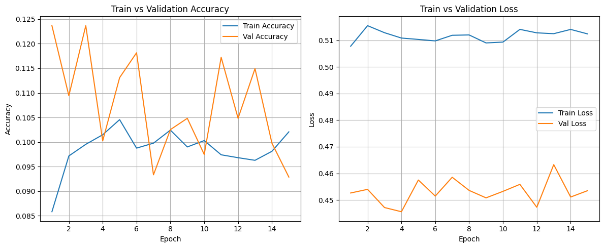

## About

Welcome to our multi-modal movie genre classification project! 🎬✨

Have you ever wondered how a computer might guess what kind of movie you're about to watch — just by reading its plot or glancing at its poster? That’s exactly what we set out to explore!

This website showcases our journey in building machine learning models that predict movie genres using both the movie’s **plot description** and its **poster image**. By leveraging the power of **text** and **visuals**, we aimed to improve prediction accuracy and understand how each modality contributes to recognizing genres like *Action*, *Comedy*, *Drama*, and more.

---

## Data and Dataset Explanation
{: #data }

[Collection](#how-did-we-collect-data) · [EDA](#exploratory-data-analysis) · [Text Prep](#label-encoding-and-text-processing)

### How did we collect data? 
{:#how-did-we-collect-data}

We decided to use the [title.basics.tsv.gz](https://developer.imdb.com/non-commercial-datasets/) from the IMDB website as our base dataset. Initially, this dataset contained ~4 million datapoints with 28 genres. So, we decided to cut down the number of genres based on the [box-office statistics](https://www.statista.com/statistics/188658/movie-genres-in-north-america-by-box-office-revenue-since-1995) to 9. We selected the genres with the highest revenue in the statistics provided. After filtering the number of genres to 9, we got a dataset which was mostly skewed towards Drama and Comedy

After filtering the number of genres to 9, the dataset was heavily skewed towards *Drama* and *Comedy* (Figure 1).

<figure class="centered-figure">
  
  <figcaption style="text-align: center;"><em>Figure 1 · Genre counts after revenue-based filtering.</em></figcaption>
</figure>

To reduce skewness in the dataset, we leveraged the number of datapoints available per genre. Since the number of movies per genre was large, we capped the number of movies in each genre to approximately  ≈ **4,000 films** as shown below.(Figure 2).

<figure class="centered-figure">
  
  <figcaption style="text-align: center;"><em>Figure 2 · Balanced distribution after capping.</em></figcaption>
</figure>

Next, the problem we faced was that the dataset we used contained only IMDb IDs, titles, and genres. It did not include posters or plots for each movie. So, we used the TMDB API to retrieve plot summaries and poster URLs. One can obtain their own API KEY for retrieving the plots and poster URLs by following the steps on the [TMDB API docs](https://developer.themoviedb.org/reference/intro/getting-started).

Using the TMDB API, we retrieved poster URLs and plots and added them to our dataset in the columns `plot` and `img`. One can directly download our filtered dataset from [Kaggle](https://www.kaggle.com/datasets/kumaramara/movies-with-poster-urls-and-plots).

After downloading the dataset, one can use this [code](download_posters.html) to download the posters. Make sure you set up your TMDB API key before running the script.

<figure class="centered-figure">
  
  <figcaption style="text-align: center;"><em>Figure 3 · Sample rows after enrichment (`plot`, `img`).</em></figcaption>
</figure>

We saved all the posters using their IMDb IDs for easy access.

<figure class="centered-figure">
  
  <figcaption style="text-align: center;"><em>Figure 4 · Random movie posters downloaded via TMDB.</em></figcaption>
</figure>

### Exploratory Data Analysis
{:#exploratory-data-analysis}

To get a better sense of our dataset before training any models, we did some quick exploratory analysis focused on how genres are distributed and how often they appear together. Since our task involves multi-label classification, understanding how many genres each movie has and which genres tend to co-occur is especially important.

<figure class="centered-figure">
  
  <figcaption style="text-align: center;">Figure: Distribution of the number of genres per movie (Most movies are tagged with only one genre)</figcaption>
</figure>

From the first plot, we can clearly see that most movies in the dataset (around 15,000) are labeled with **only one genre**. A smaller portion has **two genres**, and even fewer have **three**. 

<figure class="centered-figure">
  
  <figcaption style="text-align: center;">Figure: Genre co-occurrence matrix showing how often different genres appear together in the same movie.</figcaption>
</figure>

The second plot is a co-occurrence matrix that shows how often pairs of genres appear together. Not surprisingly, we see strong co-occurrence between:
- **Action and Crime**
- **Horror and Thriller**
- **Adventure and Action**

These genre combinations are common in real-world movies, so it makes sense they show up a lot here too. On the other hand, some genres like **Comedy** and **Sci-Fi** tend to show up more on their own, with fewer strong pairings.

This matrix also gave us a sanity check that our preprocessing was working correctly — for example, the matrix is symmetrical, which is what we expect (if "Action" co-occurs with "Crime", then "Crime" should co-occur with "Action" by the same amount).

Lastly, while our current model treats genres independently, this matrix shows that there are definitely patterns in how genres are assigned together.

---
{: #label-encoding-and-text-processing .section}
## Label Encoding and Text Preprocessing

To handle multi-label genre classification—where a movie may belong to more than one genre—we used **multi-hot encoding**. Each genre was treated as a binary label (1 if present, 0 otherwise), creating an interpretable target vector.

<figure class="centered-figure">
  
  <figcaption class="centered-caption">Figure: Multi-hot label encoding for genres.</figcaption>
</figure>

Before feeding the text into our classifiers, we applied the following preprocessing steps to clean and standardize the plot descriptions:

- Words were tokenized to isolate sentence units.
- Special characters and punctuation were removed.
- Accents were normalized (e.g., “Léon” → “Leon”).
- Common stopwords were filtered using NLTK.
- Lemmatization was used to bring tokens to a base form compatible with GloVe embeddings.

# Classifier

{: #text-model .section}
## Text Classification Model

We explored multiple architectures for textual movie genre classification, including both **Recurrent Neural Networks (LSTM)** and **Transformer-based models**. The goal was to predict one or more genres from the movie synopsis, given its multi-label nature.

### Modeling Choices and Rationale

- **Initial Attempt – BiLSTM:**  
  Our initial model used a Bidirectional LSTM with 120 hidden units, GloVe embeddings, and dropout layer. While this architecture captured sequential dependencies, it struggled to generalize well due to the limited size and variability of the dataset. Loss plateaus and modest F1 scores led us to explore Transformer-based models.

- **Transformer Models – DistilBERT and ELECTRA-Small:**  
  We next experimented with lightweight Transformers. DistilBERT, a distilled version of BERT, was faster and offered some performance gains. However, we found **ELECTRA-Small** to consistently outperform it due to its **discriminator-style pretraining**, which is more sample-efficient for classification tasks.  
  ELECTRA benefits from **bidirectional context** and **pretraining that better aligns with discriminative classification**, making it particularly suitable for genre prediction from apt length plot texts.

### Final Text Model – ELECTRA-Small

The final architecture consisted of an **ELECTRA-Small encoder** followed by a **fully connected classification head**. The classifier predicted a 9-dimensional multi-label output (one for each genre), activated through a sigmoid layer.

#### Hyperparameters:
- **Model**: ELECTRA-Small (`google/electra-small-discriminator`)
- **Loss Function**: BCEWithLogitsLoss (Binary Cross-Entropy for multi-label)
- **Optimizer**: AdamW
- **Learning Rate**: 2e-5
- **Batch Size**: 8
- **Accum**: 2
- **Epochs**: 8
- **Frozen Layers**: 4
- **Warmup Ratio**: 0.1
- **Evaluation Metric**: Weighted F1-score, Precision, and Recall

<figure class="centered-figure">
  
  <figcaption class="centered-caption">Figure: Train vs. Validation loss curve for ELECTRA-Small across 8 epochs.</figcaption>
</figure>

> Based on performance across training and validation, ELECTRA-Small was selected as our final text model. Detailed evaluation metrics and model comparisons can be found in the [Results & Evaluation](#results) section.

<figure class="centered-figure">
    
    <figcaption class="centered-caption">Figure: Electra architecture used for Text model in multi-label genre classification.</figcaption>
</figure>

---

{: #vision-model .section}
## Vision Classification Model

For genre prediction using posters, we designed and evaluated multiple convolutional neural network (CNN) architectures using movie poster images. The aim was to classify one or more genres based on the posters, considering the multi-label nature of the task.

### Modeling Choices and Rationale

- **Initial Attempt – EfficientNet-B0 and EfficientNet-B2 (Transfer Learning):**  
  We started with EfficientNet variants (B0 and B2) using a transfer learning approach. These models were initialized with pre-trained default weights, and only the final classification head was replaced. The new head included a dropout layer and a sigmoid-activated dense layer for multi-label outputs.

  Despite EfficientNet’s theoretical efficiency, both models failed to yield strong performance:
  - **Validation accuracy remained low and volatile**, fluctuating between 10–14% across epochs.
  - **Training improvements were minimal**, and metrics such as F1 and precision hovered below 0.15.
  - **Validation loss showed instability**, suggesting limited generalization and ineffective visual feature learning.

  We concluded that EfficientNet’s squeeze-excite mechanisms and scaling patterns were not well-suited for the stylized and diverse nature of movie posters.
<figure class="centered-figure">
  
  <figcaption class="centered-caption">Figure: EfficientNet-B0 training vs. validation accuracy and loss curves.</figcaption>
</figure>

<figure class="centered-figure">
  
  <figcaption class="centered-caption">Figure: EfficientNet-B2 training vs. validation accuracy and loss curves.</figcaption>
</figure>

- **Custom VGG-16 (Fine-Tuned):**  
  In response, we adopted a custom VGG-16 model. This architecture’s consistent convolutional blocks and simpler structure allowed for more interpretable and spatially focused learning.  
  We froze the earlier layers to retain low-level feature extraction and fine-tuned the deeper convolutional layers. A classification head with dropout was added to handle the multi-label output space.

  This pivot yielded **significantly better results**:
  - F1-score improved to approximately **0.42**
  - Precision and recall saw notable increases
  - Loss curves were more stable and consistent

  Overall, VGG-16 aligned better with the characteristics of our visual data, offering clearer benefits in both training stability and final performance.

<figure class="centered-figure">
    
    <figcaption class="centered-caption">Figure: Custom VGG-16 layer-wise architecture used for multi-label genre classification.</figcaption>
</figure>

### Final Vision Model – VGG-16 (Fine-Tuned)

The final model used a **pretrained VGG-16** as the feature extractor, with a custom classification head built for multi-label sigmoid outputs. Selective fine-tuning was applied to the later layers to adapt the model to genre prediction from poster imagery.

#### Hyperparameters:
- **Model**: VGG-16 (`torchvision.models.vgg16(pretrained=True)`)
- **Loss Function**: BCEWithLogitsLoss (Binary Cross-Entropy for multi-label)
- **Optimizer**: RMSProp
- **Learning Rate**: 1e-3
- **Batch Size**: 32
- **Dropout Rate**: 0.6
- **Frozen Layers**: VGG16 Architecture
- **Epochs**: 50
- **Evaluation Metric**: F1-score, Precision, and Recall

---

## Results and Evaluation
{: #results }
#### Comparative Results - Text Model
To evaluate the performance of different text-based models for multi-label genre classification, we tested a BiLSTM baseline, DistilBERT, and ELECTRA-Small. The metrics we focused on were **weighted F1-score**, **precision**, and **recall**, since they better reflect performance in imbalanced multi-label settings.

| Model              | Train Loss | Val Loss | F1 Score | Precision | Recall |
|-------------------|------------|----------|----------|-----------|--------|
| BiLSTM + GloVe    | 0.43       | 0.42     | 0.38     | 0.41      | 0.36   |
| DistilBERT        | 0.30       | 0.31     | 0.45     | 0.44      | 0.43   |
| **ELECTRA-Small** | **0.109**  | **0.27** | **0.631** | **0.60**  | **0.673** |

From the results, it's clear that **ELECTRA-Small consistently outperformed the other two models**. The BiLSTM model struggled the most, which wasn’t surprising considering its reliance on fixed word embeddings and its difficulty in capturing longer-range dependencies in text. DistilBERT performed better, likely due to its pretraining on larger corpora, but still plateaued in F1 and recall compared to ELECTRA.

What stood out was ELECTRA’s high recall score, which suggests it was better at **not missing relevant genres**, even when multiple were present. This is particularly important in our dataset where movies often belong to overlapping categories like *Romance–Drama* or *Action–Adventure*. The consistent drop in both training and validation loss also reflected stable learning without overfitting.

Overall, ELECTRA-Small offered the best trade-off between precision and recall and was the most reliable model for capturing multiple genres from plot summaries.

#### Comparative Results - Vision Modal

Below is a summary table comparing the performance of the vision-based models:

| Model              | Train Loss | Val Loss | F1 Score | Precision | Recall |
|-------------------|------------|----------|----------|-----------|--------|
| EfficientNet-B0   | 0.49       | 0.45     | 0.13     | 0.11      | 0.14   |
| EfficientNet-B2   | 0.51       | 0.45     | 0.12     | 0.10      | 0.12   |
| **VGG-16 (Final)** | **0.28**   | **0.30** | **0.421** | **0.39**  | **0.44** |

> **Conclusion**: VGG-16 emerged as the most effective vision model for our task. Its consistent structure and spatial focus allowed for better generalization on movie poster data. Compared to EfficientNet, it achieved superior results in F1, precision, and recall, satisfying our need for reliable visual classification.

---

#### Per-Genre Performance (VGG-16)

<figure class="centered-figure">
  
  <figcaption class="centered-caption">Figure: Per-class precision, recall, and F1-scores for the VGG-16 model.</figcaption>
</figure>

The per-class metrics reveal which genres were more easily predicted from visual features:

- **Comedy (F1: 0.50)** and **Drama (F1: 0.55)** had the best performance, possibly because these genres have clearer visual cues in poster design (e.g. color palettes, facial expressions, typography).
- **Thriller**, **Crime**, and **Adventure** saw lower F1-scores (~0.29–0.33), indicating a struggle to distinguish between visually similar or ambiguous posters.
- Micro, macro, and weighted F1-scores all converged around **0.40**, suggesting the model was consistent across class balance and label frequency.

While not perfect, the vision model showed meaningful contribution — especially in complementing the text-based model, which had different confusion patterns.

> Overall, VGG-16 demonstrated a better grasp of genre-specific visual traits than EfficientNet variants, likely due to its simpler structure being easier to fine-tune on a relatively small and noisy dataset.

<!-- ============ 6. REPRODUCIBILITY ================================== -->

<section id="code" class="section">
  <h2>Run Code 🛠️</h2>
  <pre>
#step 1
- clone the git repo 'git clone https://github.com/satishamara17/multi-genre-predictor' or download the zip file of our project

#step 2
- run `pip install -r requirements.txt` to get all libraries used

# Step 3
- Download our dataset using the Kaggle link provided

# step 4
- Create a API key for TMDB API

# step 5
- Next use the get_posters code provided above in the data section to download the posters

- for textual part:
    cd textual
    python train_electra_transfer.py --tsv final_data.tsv --epochs 8 --batch 8 --accum 2 --lr 2e-5 --max_len 512 --freeze_layers 4 --warmup_ratio 0.1 --out electra_transfer.pth

- for vision part most of the code is written in jupyter notebooks.
  </pre>

</section>

Links to our project :

Dataset : [kaggle](https://www.kaggle.com/datasets/kumaramara/movies-with-poster-urls-and-plots) 

Code : [git hub repo](https://github.com/satishamara17/multi-genre-predictor)

## Discussion & Future Work
{:#future-work}

### 🔍 Lessons Learned

This project gave us a hands-on understanding of the challenges and advantages of multi-modal classification. We saw firsthand that:

- **Text-based models** like ELECTRA-Small performed exceptionally well when plots contained rich, descriptive language, especially for genres like *Drama* and *Romance*.
- **Vision models** struggled more due to variability in poster design, but still added value for genres with distinct aesthetics like *Horror* and *Comedy*.
- Pretrained models are a powerful starting point, but **fine-tuning is highly dataset-dependent**, especially in multi-label tasks.
- **Genre overlap and ambiguity** (e.g. *Action vs. Adventure*, *Romance vs. Drama*) remain key challenges, and threshold tuning had a noticeable impact on model performance.

### 🚀 Potential Improvements

If we were to extend this project, we’d focus on:

- **Multi-modal Fusion**: Combining ELECTRA-Small and VGG-16 outputs via feature concatenation or late fusion, potentially with a small neural classifier on top.
- **Genre Graphs**: Introducing a genre co-occurrence graph to inform predictions and reduce confusion in overlapping genres.
- **Better Visual Representations**: Exploring CLIP or ViT-based models which might capture deeper semantic connections between posters and language.

> Overall, this project helped clarify the limits of unimodal models and reinforced why multi-modal learning is essential for nuanced tasks like movie genre classification.

## Contributors & Their Contributions
{:#contributors}

This project was a joint effort between two contributors, each responsible for specific components of the multi-modal pipeline. The work was divided in a way that allowed each member to explore different aspects of deep learning while collaborating on key design and evaluation decisions.

---

###  Abhiram Sribhashyam  
[UB Person Number : 50560760] 

**Roles**:  
- Handled the **text classification pipeline**, implementing and evaluating BiLSTM, DistilBERT, and ELECTRA-Small models.  
- Managed training, hyperparameter tuning, and validation metric logging for the text models.  
- Built the **project website** using Jekyll, including layout structure, content organization. 

---

###  Naga Sai Satish Kumar Amara  
[UB Person Number : 50565990] 

**Roles**:  
- Took care of **data preprocessing**, including filtering the IMDB metadata and preparing poster image inputs.  
- Worked on **EDA visualizations** for text-based features and contributed to overall results reporting and documentation.
- Focused on the **vision model pipeline**, experimenting with EfficientNet-B0/B2 and fine-tuning a VGG-16 architecture.  

